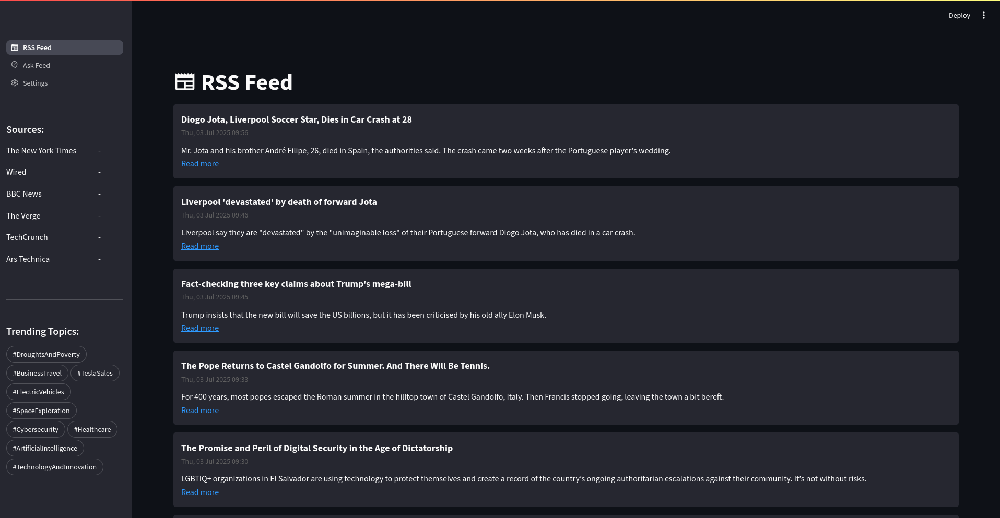
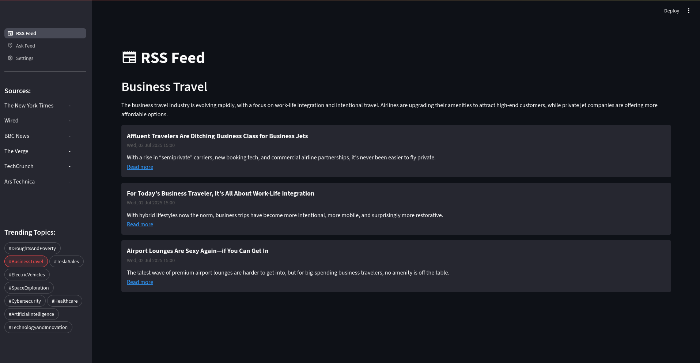
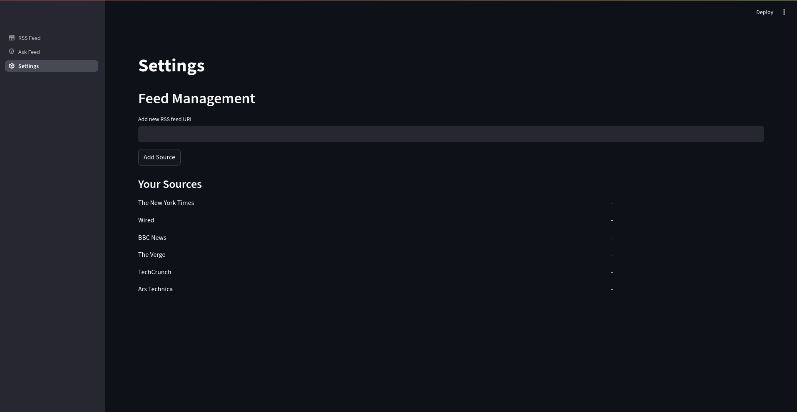
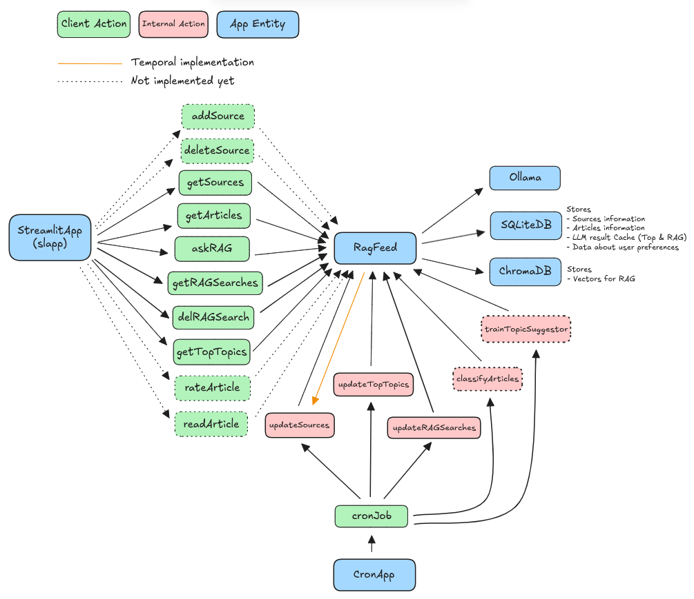

# RagFeed

RagFeed is a feed reader powered by RAG and LLM models.

The main feature are:
- **Trending Topics**: Provide an overview of the most relevant topics based the articles provided by the RSS sources added by the user. 
- **Ask Feed**: Allow the user to ask for specific topics and get an orview of them and the most relevant related articles.

## Next Features:
- Improve RSS parse algorithm.
- Source management flow.
- Allow to mark articles as Read/Undead.
- Allow to rate articles interest.
- Internal reader.
- Article recomendation algorithm.
- Presonalized feed.
- Improve app look and feel.
- ...

## Preview
### RSS Feed view

### Trending Topics Feed view

### Rag Search view

### Settings view

## Dependencies
- The project expects an instance of [ollama](https://ollama.com/download) running at `http://localhost:11434/`
- Model `llama3.1:8b` available in [ollama](https://ollama.com/library/llama3.1)
- Embedder `snowflake-arctic-embed2` available in [ollama](https://ollama.com/library/snowflake-arctic-embed2)
- Python dependencies in `requirements.txt` installed (recomended to use a virtual environment)

**Note**: Default ollama url, model and embedder used can be edited on `settings.py`

## Current limitations
- Sources must be added directly on the database.
- The app must be used in Dark Mode. 
- Settings page is a placeholder.

## How to run
1. Clone repository
2. Enter in directory
    `cd RagFeed`
2. Install depencies 
    `pip install -r requirements.txt`
3. Create SQLite Database
    `sqlite3 ./data/sqlite/ragfeed.db < ./db/ragfeed_schema.sql`
4. Launch the cron: \
    `python cronapp.py` (this will run until stopped)    
5. Run client  application:\
    `python -m streamlit run slapp.py`
6. Access through the provided url
 
## Repository File Structure:
### Directories
- `data`: Is the default folder for the app to store the data.
    - `chroma`: Directory used by ChromaDB to save vectors (empty in the repository).
    - `sqlite`: Directry where SQLite database will be stored (empty in the repository).
- `db`:  Contains the SQL script with the database schema.
- `docs`: Contains documentation of the project, the Exploratory Data Analysis and Snapshots of the app.
- `log`: Default directory used by the app to store the logfile (empty in the repository). 
- `slapp`: Contains the code for the different pages in the streamlit application.
- `src`: Contains the classes for the RAGFeed Backend including logic and different controllers.

**Note**: Data and log directories can be modified in `settings.py`

### Main App files files
- `cronapp.py`: Is the cron application in charge on updating Sources, Trending Topics and Rag Searches stored.
- `RagFeed.py`: Is the backend controller, this class is instanced by the clients to access the app fucntions.
- `settings.py`: Contain the settings to configure the project execution.
- `slapp.py`: Main file of the streamlit application.

## Settings
The file `settings.py` contains some settings to modify RagFeed behaviour:
- `logger_path`: Directiory where logger will store the log files for the application.
- `logger_level`: Log level to store in log file, accepted vlaues are the numeric described for [logging](https://docs.python.org/3/library/logging.html#logging-levels) library.
    - `10`: DEBUG, logs inputs and outputs for majority of methods.
    - `20`: INFO, logs the name of the methods that are being called.
    - `30`: WARNING, logs minor errors.
    - `40`: ERROR, logs major errors.
- `feeds_update_freq`: Min number of hours between each update. The app will not request the Source for updates if the time since last update is bellow this threshold. The only exception is the `cronapp.py` that will force an update on it's first iteration.
- `vector_store_engine`: Provided for the vector store. Currently only `chroma` is valid.
- `chromadb_collection`: Name for the ChormaDB collection.
- `chromadb_path`: Relative path for the ChromaDB persistent storage.
- `database_engine`: Database provider. Currently only `sqlite` is valid.
- `sqlite_path`: Relative file path for the SQLite database (including file name).
- `model_source`: Provider for the GenAI capabilities. Currently only `ollama` is valid.
- `ollama_url`: URL for the Ollama instance.
- `ollama_llm`: LLM model to be used by Ollama
- `ollama_embeddings`: Embedder model to be use by Ollama.

## App Schema

## Providers Modularity
Currently RagFeed is implemented to be used with Ollama, SQLite and Chroma DB but the code has been done considering the posibility of implement alternative sources.

In case you want to use it with a different LLM, database or vectore store you can rewrite the required controller for the prvoder:
- `src/chromaVectorStore.py`: Contains all the Vector Store required methods.
- `src/SqliteDatabase.py`: Contains all the database required methods.
- `src/ollamaModel.py`: Contains all the GenAI required methods.

Inheritance was not created for the MVP but could be something to implement later (based on de mentioned files) if more providers are implemented.

In case you change database provider consider you must also define the database creation script (`db/ragfeed_schema.sql` for SQLite)

Class initialization is done in the `RagFeed.__init()__` method (`RagFeed.py`) based on the options defined in `settings.py`. This will also need to be updated if new modules are added.

## About the project
This project born as final project of a [Data Science & Machine Learning Bootcamp](https://www.ironhack.com/es-en/data-science-machine-learning/remote) I attended in between on May and July 2025.

All the details about the project implementation can be found in the presentation located in `docs/RagFeed.pdf`.

There is a Jupyter Notebook with a brief Exploratory Data Analysis done on test data during the development in `docs/ragfeed.ipynb`. 

The branch ironhack will keep a version of the code on project delivery date.

